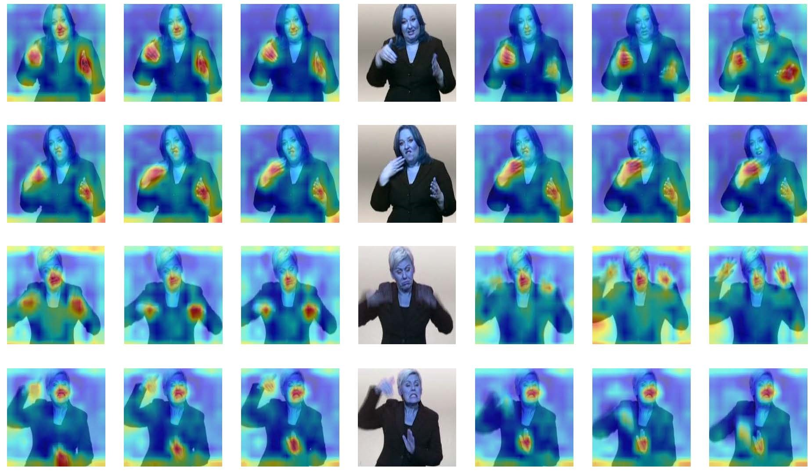

# CorrNet+
This repo holds codes of the paper: CorrNet+: Sign Language Recognition and Translation via Spatial-Temporal Correlation, which is an extension of our previous work (CVPR 2023) [[paper]](https://arxiv.org/abs/2303.03202)

For the code supporting continuous sign language recognition and sign language translation, refer to [CorrNet_Plus_CSLR](./CorrNet_Plus_CSLR) and [CorrNet_Plus_SLT](./CorrNet_Plus_SLT) for their codes, respectively.

The code of CorrNet_Plus_SLT is updating and will be released later.

## Performance
- On the continuous sign language cognition task, CorrNet+ achieves superior performance on PHOENIX14, PHOENIX14-T, CSL-Daily and CSL datasets.

<table align="center">
<tbody align="center" valign="center">
    <tr>
        <td rowspan="3">Method</td>
        <td colspan="4">PHOENIX2014</td>
        <td colspan="2">PHOENIX2014-T</td>
        <td colspan="2">CSL-Daily</td>
    </tr>
    <tr>
        <td colspan="2">Dev(%)</td>
        <td colspan="2">Test(%)</td>
        <td rowspan="2">Dev(%)</td>
        <td rowspan="2">Test(%)</td>
        <td rowspan="2">Dev(%)</td>
        <td rowspan="2">Test(%)</td>
    </tr>
    <tr>
        <td>del/ins</td>
        <td>WER</td>
        <td>del/ins</td>
        <td>WER</td>
    </tr>
    <tr>
        <td>CVT-SLR (CVPR2023)</td>
        <td>6.4/2.6</td>
        <td>19.8</td>
        <td>6.1/2.3</td>
        <td>20.1</td>
        <td>19.4</td>
        <td>20.3</td>
        <td>-</td>
        <td>-</td>
    </tr>
    <tr>
        <td>CoSign-2s (ICCV2023)</td>
        <td>-</td>
        <td>19.7</td>
        <td>-</td>
        <td>20.1</td>
        <td>19.5</td>
        <td>20.1</td>
        <td>-</td>
        <td>-</td>
    </tr>
    <tr>
        <td>AdaSize (PR2024)</td>
        <td>7.0/2.6</td>
        <td>19.7</td>
        <td>7.2/3.1</td>
        <td>20.9</td>
        <td>19.7</td>
        <td>21.2</td>
        <td>31.3</td>
        <td>30.9</td>
    </tr>
    <tr>
        <td>AdaBrowse+ (ACMMM2023)</td>
        <td>6.0/2.5</td>
        <td>19.6</td>
        <td>5.9/2.6</td>
        <td>20.7</td>
        <td>19.5</td>
        <td>20.6</td>
        <td>31.2</td>
        <td>30.7</td>
    </tr>
    <tr>
        <td>SEN (AAAI2023)</td>
        <td>5.8/2.6</td>
        <td>19.5</td>
        <td>7.3/4.0</td>
        <td>21.0</td>
        <td>19.3</td>
        <td>20.7</td>
        <td>31.1</td>
        <td>30.7</td>
    </tr>
    <tr>
        <td>CTCA (CVPR2023)</td>
        <td>6.2/2.9</td>
        <td>19.5</td>
        <td>6.1/2.6</td>
        <td>20.1</td>
        <td>19.3</td>
        <td>20.3</td>
        <td>31.3</td>
        <td>29.4</td>
    </tr>
    <tr>
        <td>C2SLR (CVPR2022)</td>
        <td>-</td>
        <td>20.5</td>
        <td>-</td>
        <td>20.4</td>
        <td>20.2</td>
        <td>20.4</td>
        <td>-</td>
        <td>-</td>
    </tr>
    <tr>
        <th>CorrNet+</th>
        <td>5.3/2.7</td>
        <th>18.0</th>
        <td>5.6/2.4</td>
        <th>18.2</th>
        <th>17.2</th>
        <th>19.1</th>
        <th>28.6</th>
        <th>28.2</th>
    </tr>
</tbody>
</table>

- On the sign language translation task, CorrNet+ achieves superior performance on PHOENIX14, PHOENIX14-T and CSL-Daily datasets.

<table>
<tbody align="center" valign="center">
    <tr>
        <td colspan="11">PHOENIX2014-T</td>
    </tr>
    <tr>
        <td>Method</td>
        <td colspan="5">Dev(%)</td>
        <td colspan="5">Test(%)</td>
    </tr>
    <tr>
        <td></td>
        <td>Rouge</td>
        <td>BLEU1</td>
        <td>BLEU2</td>
        <td>BLEU3</td>
        <td>BLEU4</td>
        <td>Rouge</td>
        <td>BLEU1</td>
        <td>BLEU2</td>
        <td>BLEU3</td>
        <td>BLEU4</td>
    </tr>
    <tr>
        <td>SignBT (CVPR2021)</td>
        <td>50.29</td>
        <td>51.11</td>
        <td>37.90</td>
        <td>29.80</td>
        <td>24.45</td>
        <td>49.54</td>
        <td>50.80</td>
        <td>37.75</td>
        <td>29.72</td>
        <td>24.32</td>
    </tr>
    <tr>
        <td>MMTLB (CVPR2022)</td>
        <td>53.10</td>
        <td>53.95</td>
        <td>41.12</td>
        <td>33.14</td>
        <td>27.61</td>
        <td>52.65</td>
        <td>53.97</td>
        <td>41.75</td>
        <td>33.84</td>
        <td>28.39</td>
    </tr>
    <tr>
        <td>SLTUNET (ICLR2023)</td>
        <td>52.23</td>
        <td>-</td>
        <td>-</td>
        <td>-</td>
        <td>27.87</td>
        <td>52.11</td>
        <td>52.92</td>
        <td>41.76</td>
        <td>33.99</td>
        <td>28.47</td>
    </tr>
    <tr>
        <td>TwoStream-SLT (NeuIPS2023)</td>
        <td>54.08</td>
        <td>54.32</td>
        <td>41.99</td>
        <td>34.15</td>
        <td>28.66</td>
        <td>53.48</td>
        <td>54.90</td>
        <td>42.43</td>
        <td>34.46</td>
        <td>28.95</td>
    </tr>
    <tr>
        <td>CorrNet+</td>
        <th>54.54</th>
        <th>54.56</th>
        <th>42.31</th>
        <th>34.48</th>
        <th>29.13</th>
        <th>53.76</th>
        <th>55.32</th>
        <th>42.74</th>
        <th>34.86</th>
        <th>29.42</th>
    </tr>
    <tr>
        <td colspan="11">CSL-Daily</td>
    </tr>
    <tr>
        <td>Method</td>
        <td colspan="5">Dev(%)</td>
        <td colspan="5">Test(%)</td>
    </tr>
    <tr>
        <td></td>
        <td>Rouge</td>
        <td>BLEU1</td>
        <td>BLEU2</td>
        <td>BLEU3</td>
        <td>BLEU4</td>
        <td>Rouge</td>
        <td>BLEU1</td>
        <td>BLEU2</td>
        <td>BLEU3</td>
        <td>BLEU4</td>
    </tr>
    <tr>
        <td>SignBT (CVPR2021)</td>
        <td>49.49</td>
        <td>51.46</td>
        <td>37.23</td>
        <td>27.51</td>
        <td>20.80</td>
        <td>49.31</td>
        <td>51.42</td>
        <td>37.26</td>
        <td>27.76</td>
        <td>21.34</td>
    </tr>
    <tr>
        <td>MMTLB (CVPR2022)</td>
        <td>53.38</td>
        <td>53.81</td>
        <td>40.84</td>
        <td>31.29</td>
        <td>24.42</td>
        <td>53.25</td>
        <td>53.31</td>
        <td>40.41</td>
        <td>30.87</td>
        <td>23.92</td>
    </tr>
    <tr>
        <td>SLTUNET (ICLR2023)</td>
        <td>53.58</td>
        <td>-</td>
        <td>-</td>
        <td>-</td>
        <td>23.99</td>
        <td>54.08</td>
        <td>54.98</td>
        <td>41.44</td>
        <td>31.84</td>
        <td>25.01</td>
    </tr>
    <tr>
        <td>TwoStream-SLT (NeuIPS2023)</td>
        <td>55.10</td>
        <td>55.21</td>
        <td>42.31</td>
        <td>32.71</td>
        <td>25.76</td>
        <td>55.72</td>
        <td>55.44</td>
        <td>42.59</td>
        <td>32.87</td>
        <td>25.79</td>
    </tr>
    <tr>
        <td>CorrNet+</td>
        <th>55.52</th>
        <th>55.64</th>
        <th>42.78</th>
        <th>33.13</th>
        <th>26.14</th>
        <th>55.84</th>
        <th>55.82</th>
        <th>42.96</th>
        <th>33.26</th>
        <th>26.14</th>
    </tr>
</tbody>
</table>

## Visualizations

As shown below, our method intelligently models the human body trajectories across adjacent frames and pays special attention to the moving human body parts.

    
     
    
Heatmaps of human body trajectories

## Data preparation, Environment, Training, Inference and Visualizations
For detailed instructions of data preparation, environment, training, inference and visualizations, please refer to each sub-repo for guidance.